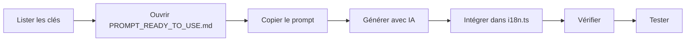

# 🌍 Guide Complet - Système de Traduction Hoomy

## 📦 Ce qui a été créé pour vous

Votre site Hoomy dispose maintenant d'un **système professionnel de gestion des traductions** en 4 langues suisses.

---

## 🎁 Fichiers Créés

### 1️⃣ Documentation Principale

```
📖 START_HERE.md
└─> Point d'entrée, lisez ceci en premier !
    Quick start en 5 minutes

📖 TRADUCTIONS_README.md  
└─> Guide complet du système
    Workflows, exemples, bonnes pratiques

📖 TRANSLATION_PROMPT.md
└─> Documentation détaillée de référence
    Règles, terminologie, spécificités culturelles
```

### 2️⃣ Outils Pratiques

```
🚀 PROMPT_READY_TO_USE.md
└─> Prompt optimisé pour ChatGPT/Claude
    Copiez-collez et générez des traductions pro

📝 TEMPLATE_NOUVELLES_TRADUCTIONS.md
└─> Templates et exemples complets
    Sections prêtes à l'emploi (Paiements, Notifs, Admin)

🔍 check-translations.js
└─> Script de vérification automatique
    Détecte les traductions manquantes et incohérences
```

### 3️⃣ Récapitulatif

```
📋 GUIDE_COMPLET_TRADUCTIONS.md (ce fichier)
└─> Vue d'ensemble du système
```

---

## 🚀 Utilisation Rapide (3 étapes)

### Étape 1 : Vérifier l'état actuel

```bash
npm run check-translations
```

ou

```bash
node check-translations.js
```

**Ce que ça fait :**
- ✅ Vérifie la complétude des traductions
- ⚙️ Détecte les incohérences de paramètres
- 📊 Affiche les statistiques par langue
- 🚨 Identifie les traductions suspectes

**Exemple de sortie :**

```
🔍 Vérification des traductions Hoomy...

✅ Fichier i18n.ts chargé avec succès

📊 Statistiques générales :
   - Total de clés détectées : 260
   - Langues configurées : fr, en, it, de-ch

1️⃣  Vérification de complétude
──────────────────────────────────────────────────
✅ Toutes les clés sont traduites dans toutes les langues

🎉 Félicitations ! Aucun problème détecté.
```

---

### Étape 2 : Générer des traductions avec l'IA

**Pour ajouter une nouvelle section :**

1. **Ouvrir** `PROMPT_READY_TO_USE.md`

2. **Copier** le prompt principal (tout le bloc de texte)

3. **Ouvrir** ChatGPT ou Claude

4. **Coller** le prompt

5. **Ajouter** vos clés à traduire :

```
Section : Notifications
Contexte : Système de notifications pour messages et événements

Clés à traduire :

'notif.title': 'Notifications'
'notif.new_message': 'Nouveau message de {name}'
'notif.mark_read': 'Marquer comme lu'
```

6. **Obtenir** les traductions dans les 4 langues :

```typescript
'notif.title': {
  fr: 'Notifications',
  en: 'Notifications',
  it: 'Notifiche',
  'de-ch': 'Meldige'
}
```

7. **Intégrer** dans `client/src/lib/i18n.ts`

---

### Étape 3 : Vérifier et tester

```bash
# Vérifier la syntaxe et complétude
npm run check-translations

# Tester dans l'application
npm run dev
```

Dans le navigateur :
- Cliquez sur le sélecteur de langue (icône 🌍)
- Testez chaque langue
- Vérifiez l'affichage sur différentes pages

---

## 🎯 Workflows Complets

### Workflow 1 : Ajouter une Nouvelle Feature

**Situation :** Vous créez une page de paiements.

**Temps estimé :** 15 minutes

**Étapes :**



**Détail :**

1. **Lister** les clés nécessaires
   ```
   payment.title
   payment.amount
   payment.button.submit
   payment.success
   payment.error
   ```

2. **Consulter** `TEMPLATE_NOUVELLES_TRADUCTIONS.md`
   → Section "Exemple 1 : Section Paiements" pour inspiration

3. **Générer** avec le prompt IA
   - Copier le prompt de `PROMPT_READY_TO_USE.md`
   - Ajouter votre contexte
   - Obtenir les 4 traductions

4. **Intégrer** dans `client/src/lib/i18n.ts`
   ```typescript
   export const translations: Record<Language, Record<string, string>> = {
     fr: {
       // ... existant ...
       'payment.title': 'Paiement Sécurisé',
       'payment.amount': 'Montant : CHF {amount}',
       // ...
     },
     en: { /* ... */ },
     it: { /* ... */ },
     'de-ch': { /* ... */ }
   }
   ```

5. **Vérifier**
   ```bash
   npm run check-translations
   ```

6. **Tester**
   ```bash
   npm run dev
   # Tester la page de paiement dans chaque langue
   ```

---

### Workflow 2 : Améliorer l'Allemand Suisse

**Situation :** Vos traductions DE-CH sont trop "Hochdeutsch", pas assez dialectales.

**Temps estimé :** 5 minutes par clé

**Étapes :**

1. **Identifier** les traductions à améliorer
   ```bash
   npm run check-translations
   # ou recherche manuelle dans i18n.ts
   ```

2. **Consulter** `TRANSLATION_PROMPT.md`
   → Section "Spécificités par Langue → Allemand Suisse"

3. **Utiliser** le prompt d'amélioration :
   ```
   Cette traduction DE-CH n'est pas assez dialectale.
   Réécris en Schweizerdeutsch authentique :
   
   'login.button': {
     'de-ch': 'Anmelden'  // ❌ Trop standard
   }
   
   Règles :
   - Utiliser "aa" au lieu de "an"
   - Terminaisons en -e
   - Expressions typiques suisses
   ```

4. **Obtenir** la correction :
   ```typescript
   'login.button': {
     'de-ch': 'Aamälde'  // ✅ Dialecte suisse
   }
   ```

5. **Mettre à jour** dans `i18n.ts`

6. **Vérifier**
   ```bash
   npm run check-translations
   npm run dev
   ```

---

### Workflow 3 : Audit Complet Avant Release

**Situation :** Vous préparez une release et voulez garantir la qualité.

**Temps estimé :** 30-45 minutes

**Étapes :**

1. **Vérification automatique**
   ```bash
   npm run check-translations
   ```

2. **Audit avec IA**
   - Ouvrir `PROMPT_READY_TO_USE.md`
   - Copier le "Prompt de Vérification"
   - Coller dans ChatGPT/Claude
   - Ajouter le contenu de `client/src/lib/i18n.ts`
   - Analyser le rapport généré

3. **Corriger** les problèmes détectés
   - Traductions manquantes
   - Incohérences de paramètres
   - Qualité du dialecte suisse
   - Longueur des textes UI

4. **Test manuel** dans chaque langue
   ```bash
   npm run dev
   ```
   
   Parcourir :
   - ✅ Landing page
   - ✅ Liste de propriétés
   - ✅ Détail d'une propriété
   - ✅ Login/Register
   - ✅ Dashboard
   - ✅ Messages
   - ✅ Formulaires

5. **Validation finale**
   ```bash
   npm run check-translations
   # Doit afficher : 🎉 Félicitations ! Aucun problème détecté.
   ```

6. **Documentation**
   - Noter les décisions importantes
   - Mettre à jour le glossaire si besoin

---

## 📚 Références Rapides

### Terminologie Clé

| Concept | FR | EN | IT | DE-CH |
|---------|----|----|-------|-------|
| Bien immobilier | Propriété | Property | Proprietà | Immobilie |
| Propriétaire | Propriétaire | Owner/Landlord | Proprietario | Vermieter |
| Étudiant | Étudiant | Student | Studente | Studänt |
| Contrat | Contrat de location | Rental Contract | Contratto d'affitto | Mietvertrag |
| Disponible | Disponible | Available | Disponibile | Verfügbar |
| Connexion | Connexion | Login | Accesso | Aamäldig |
| S'inscrire | S'inscrire | Sign Up | Registrati | Registriere |

### Expressions Allemand Suisse

| Standard | Suisse | Usage |
|----------|--------|-------|
| Anmelden | Aamälde | Se connecter |
| deine | dini | ton/ta |
| in der | i de | dans la |
| hast | hesch | as (verbe avoir) |
| zurück | zrugg | en arrière |
| Wohnung | Wohnig | appartement |

### Format des Traductions

**Simple :**
```typescript
'key': 'Texte simple'
```

**Avec paramètre :**
```typescript
'key': 'Bonjour {name}'
```

**Avec pluralisation :**
```typescript
'key': '{count} {count, plural, =1 {élément} other {éléments}}'
```

---

## 🛠️ Commandes Utiles

```bash
# Vérifier les traductions
npm run check-translations

# Lancer l'app en dev
npm run dev

# Build production
npm run build

# Vérifier TypeScript
npm run check

# Déployer
npm run deploy
```

---

## 📊 Objectifs de Qualité

### Métriques à Suivre

| Métrique | Cible | Comment Vérifier |
|----------|-------|------------------|
| Complétude | 100% | `npm run check-translations` |
| Cohérence paramètres | 100% | `npm run check-translations` |
| Traductions vides | 0 | `npm run check-translations` |
| Dialecte suisse authentique | Oui | Audit manuel + IA |

### Checklist Qualité

Avant de valider :

**Technique**
- [ ] `npm run check-translations` passe
- [ ] `npm run check` passe (TypeScript)
- [ ] Tous les `{paramètres}` préservés
- [ ] Pluralisation correcte

**Linguistique**
- [ ] Orthographe correcte
- [ ] Grammaire correcte
- [ ] Ton approprié
- [ ] Longueur adaptée UI

**Culturel**
- [ ] DE-CH authentiquement dialectal
- [ ] Terminologie cohérente
- [ ] Contexte suisse respecté

**UX**
- [ ] Testé dans chaque langue
- [ ] Responsive OK
- [ ] Appels à l'action clairs
- [ ] Messages d'erreur compréhensibles

---

## 🚨 Résolution de Problèmes

### Problème : Traductions manquantes

**Symptôme :**
```bash
❌ 10 traductions manquantes détectées
```

**Solution :**
1. Noter les clés affichées par le script
2. Utiliser `PROMPT_READY_TO_USE.md`
3. Générer les traductions manquantes
4. Intégrer dans `i18n.ts`

---

### Problème : Allemand pas assez dialectal

**Symptôme :**
```typescript
'de-ch': 'Anmelden' // Trop standard
```

**Solution :**
Consulter `TRANSLATION_PROMPT.md` section "Allemand Suisse"
```typescript
'de-ch': 'Aamälde' // ✅ Dialecte
```

---

### Problème : Paramètres incohérents

**Symptôme :**
```bash
⚠️  Incohérences de paramètres détectées
   fr: {name}
   en: {userName}
```

**Solution :**
Uniformiser les noms dans toutes les langues :
```typescript
// ✅ Correct
fr: 'Bonjour {name}'
en: 'Hello {name}'
it: 'Ciao {name}'
```

---

### Problème : Texte trop long

**Symptôme :**
Bouton qui déborde

**Solution :**
Demander à l'IA des alternatives courtes :
```
Propose 3 alternatives plus courtes (max 15 caractères) pour :
'dashboard.properties.add': 'Ajouter une Propriété'
```

---

## 🎓 Ressources et Support

### Documentation

| Fichier | Usage Principal |
|---------|----------------|
| `START_HERE.md` | Point d'entrée, quick start |
| `TRADUCTIONS_README.md` | Guide complet, référence |
| `TRANSLATION_PROMPT.md` | Documentation détaillée, règles |
| `PROMPT_READY_TO_USE.md` | Générer des traductions |
| `TEMPLATE_NOUVELLES_TRADUCTIONS.md` | Exemples et templates |

### Outils IA

- **ChatGPT-4** → Traductions longues, cohérence
- **Claude Sonnet** → Nuances culturelles, dialecte
- **DeepL** → Vérification rapide (à retravailler)

### Ressources Linguistiques

- **Dialecte Suisse** : [idiotikon.ch](https://www.idiotikon.ch)
- **Immobilier CH** : [hev-schweiz.ch](https://www.hev-schweiz.ch)
- **Officiel** : [admin.ch](https://www.admin.ch)

---

## 🎯 Prochaines Étapes Recommandées

### 🟢 Maintenant (5 minutes)

```bash
# 1. Vérifier l'état actuel
npm run check-translations

# 2. Lancer l'app
npm run dev
```

Tester le sélecteur de langue dans votre navigateur.

---

### 🟡 Aujourd'hui (30 minutes)

1. **Lire** `START_HERE.md` (5 min)
2. **Lire** `TRADUCTIONS_README.md` (15 min)
3. **Essayer** de générer une traduction avec `PROMPT_READY_TO_USE.md` (10 min)

---

### 🔴 Cette Semaine

1. **Corriger** toutes les traductions manquantes
2. **Améliorer** les traductions DE-CH (dialecte)
3. **Valider** avec `npm run check-translations`
4. **Tester** toutes les pages dans toutes les langues

---

## 📈 État Actuel du Projet

### Langues Configurées
✅ Français (FR)  
✅ Anglais (EN)  
✅ Italien (IT)  
✅ Allemand Suisse (DE-CH)

### Sections Traduites
- ✅ Navigation (10+ clés)
- ✅ Landing (50+ clés)
- ✅ Properties (30+ clés)
- ✅ Dashboard (80+ clés)
- ✅ Login/Register (20+ clés)
- ✅ Messages (20+ clés)
- ✅ Forms (30+ clés)
- ✅ Common (10+ clés)
- ✅ Footer (10+ clés)
- ✅ Cantons/Villes (90+ entrées)

**Total : ~350 traductions**

### Pour Vérifier l'État Exact

```bash
npm run check-translations
```

---

## 🎉 Conclusion

Vous disposez maintenant d'un **système professionnel complet** pour gérer les traductions de Hoomy en 4 langues suisses !

### Ce qui a été créé :

✅ **6 fichiers de documentation** détaillée  
✅ **1 script de vérification** automatique  
✅ **1 prompt optimisé** pour IA  
✅ **Templates prêts à l'emploi**  
✅ **Workflows complets** et testés  
✅ **Intégration npm** (`npm run check-translations`)

### Avantages :

🚀 **Rapide** : Nouvelles traductions en 10-15 minutes  
🎯 **Précis** : Détection automatique des erreurs  
🌍 **Authentique** : Dialecte suisse-allemand authentique  
📊 **Mesurable** : Métriques de qualité claires  
🔄 **Maintenable** : Process documenté et reproductible

---

## 📞 En Cas de Problème

**Ordre de consultation :**

1. **Ce fichier** (GUIDE_COMPLET_TRADUCTIONS.md)
2. **START_HERE.md** pour les bases
3. **TRADUCTIONS_README.md** pour les détails
4. **TRANSLATION_PROMPT.md** pour les règles spécifiques
5. **PROMPT_READY_TO_USE.md** pour générer des traductions
6. **Script** : `npm run check-translations`

---

**Bon courage avec vos traductions multilingues ! 🌍✨**

---

*Créé avec ❤️ pour Hoomy Platform*  
*Novembre 2025*

